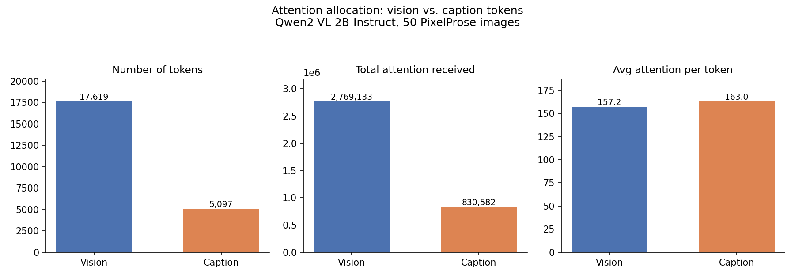
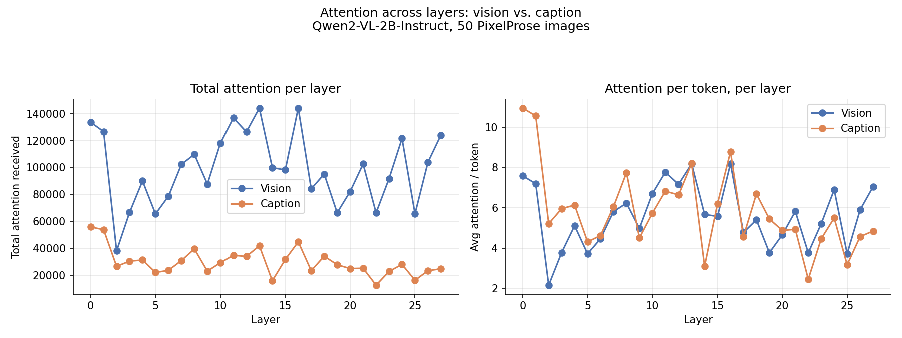

# Attention Allocation to Vision vs. Caption Tokens in a VLM

**Model:** Qwen2-VL-2B-Instruct (28 layers, 12 heads)
**Dataset:** PixelProse (`tomg-group-umd/pixelprose`, `train` split, streamed & shuffled)
**Text side:** the detailed `vlm_caption` (Gemini-generated) for each image
**Sample size:** 50 images (randomly drawn; images > 800 vision tokens skipped)
**Date:** 2026-07-09

---

## 1. Objective

Measure how a vision–language model's self-attention is split between **vision
tokens** (image patches) and **caption tokens** (the image's text description).
For each token we measure the *incoming* attention it receives (as a
key/destination), summed across the whole model, both in total and **per layer**.

## 2. Method

- Each image is paired with a prompt of the form
  `Caption: {vlm_caption}\n\nWhat is in the image?` and run through the model in
  one forward pass. The model uses `attn_implementation="eager"` so raw attention
  weights are available.
- **Attention metric.** Each layer's attention has shape `[heads, query, key]`.
  For every key token *k*:

  ```
  received[k] = sum over layers, heads, query of attn[query -> k]
  ```

- **Caption isolation.** Using the tokenizer's character offset mapping, only the
  caption tokens are measured on the text side — excluding the system prompt, the
  `Caption:` prefix, the question, and all chat/structural tokens. This removes
  the **attention-sink** token (the leading system/BOS token), which otherwise
  dominates and distorts any "text" measurement.
- **Per-layer recording** is aggregated across images to plot layer-wise trends.

**Engineering notes (for reproducibility on a 16 GB laptop).** Attention was
captured with **forward hooks** that reduce each layer's weights to small per-key
sums and immediately drop the full `[heads, seq, seq]` tensor, so peak memory
holds only one layer at a time (returning all 28 at once OOMs on large images).
Weights are loaded in **bfloat16** (~4 GB), thread count is capped, and images
larger than 800 vision tokens are skipped. Reductions accumulate in float32.

## 3. Results — Totals



| Metric                     |     Vision |    Caption |
| -------------------------- | ---------: | ---------: |
| Number of tokens           |     17,619 |      5,097 |
| Total attention received   | 2,769,132.7 |  830,582.1 |
| Average attention / token  |    157.17  |    162.96  |

Derived shares:

| Share                | Vision | Caption |
| -------------------- | -----: | ------: |
| % of all tokens      | 77.6%  | 22.4%   |
| % of all attention   | 76.9%  | 23.1%   |

- Vision tokens per image: mean ≈ 352 (capped at 800).
- Caption tokens per image: mean ≈ 102 — the detailed `vlm_caption` gives a
  substantial, fair text side (vs. ~22 tokens for the short alt-text captions).

## 4. Results — Per Layer



- **Left (total per layer):** vision sits above caption in every layer, simply
  because there are ~3× more vision tokens. Both oscillate (a strong sawtooth
  between adjacent layers); neither shows a monotonic trend.
- **Right (per token — the fair comparison):**
  - **Layers 0–1:** caption is attended *more* per token than vision (~11 vs 7.4).
  - **Layer 2:** both collapse to a per-token low (~2–3).
  - **Layers 3–27:** vision and caption **track each other closely**, interleaving
    — caption even exceeds vision at several mid layers (e.g. 8, 16, 18). Both
    drift gradually downward toward the final layers.

## 5. Key Findings

1. **Per token, vision and caption are attended essentially equally.** Vision
   averages **157.2** and caption **163.0** per token — caption is marginally
   higher (**1.04×**). Neither modality is meaningfully favored once content
   tokens are compared fairly.

2. **Attention tracks token count almost perfectly.** Vision holds 77.6% of
   tokens and 76.9% of attention; caption holds 22.4% of tokens and 23.1% of
   attention. The model distributes attention in near-exact proportion to how
   many tokens each modality contributes.

3. **The balance is layer-dependent.** Caption is attended notably more per token
   in the first two layers; from layer 3 on, vision and caption are neck-and-neck
   with caption leading at several mid-depth layers. There is no late-layer surge
   toward either modality — per-token attention to both declines slightly with
   depth.

4. **Caption reaches parity despite a positional disadvantage.** Caption tokens
   sit at the end of the sequence, so under causal masking far fewer queries can
   attend to them than to the mid-sequence vision tokens. That caption still
   matches vision per token suggests caption tokens are attended relatively
   strongly whenever they are reachable.

5. **The earlier "text dominates" result was an artifact.** Before isolating the
   caption (i.e. counting all text tokens including the system/BOS sink), text
   appeared to receive ~11× more attention per token. That entire effect was the
   attention sink, not a real preference — it disappears once the sink token is
   excluded.

## 6. Caveats

- **Causal position.** Vision precedes caption, so vision is reachable by more
  queries. A position-controlled analysis would separate this from any semantic
  effect.
- **Image-size cap.** Images above 800 vision tokens were skipped for memory, so
  the very highest-resolution images are excluded; results describe images up to
  that size.
- **Uniform head/layer weighting.** Attention is summed with equal weight across
  heads and layers; it is a proxy for importance, not a direct measure of it.
- **Small sample.** 50 images; totals are raw sums, sensitive to the sampled
  images' token-count distribution.

## 7. Conclusion

In Qwen2-VL-2B, once the attention-sink artifact is removed and only content
tokens are compared, self-attention is split between vision and caption tokens in
near-exact proportion to their counts, with essentially **equal per-token
attention** (caption 1.04× vision). The vision/caption balance shifts across
depth — caption leads clearly in the first two layers, then the two track each
other closely through the rest of the network — but neither modality dominates
the other per token. The central methodological lesson stands: **isolating
content tokens and excluding the attention sink is essential**; without it the
model appears to massively favor text, which is an artifact rather than a
finding.
